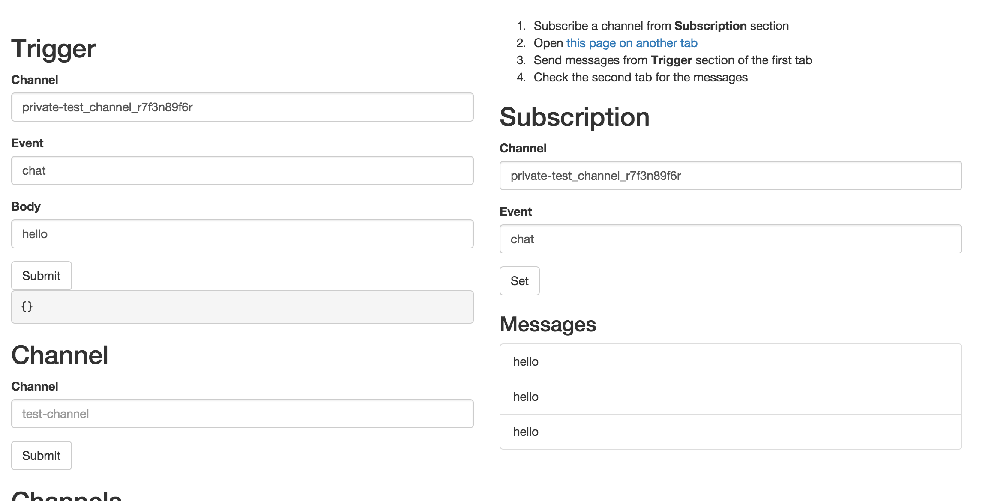

# akka-pusher-play-app

[![CI][ci-image]][ci-link]
[](LICENSE)

This is the sample Play framework app using [akka-pusher](https://github.com/dtaniwaki/akka-pusher).

```bash
export PUSHER_APP_ID="YOUR APP ID"
export PUHSER_API_KEY="YOUR APP KEY"
export PUSHER_API_SECRET="YOUR API SECRET"
sbt run
```

And access http://localhost:9000/pusher

Working sample is [available on Heroku](https://akka-pusher-play-app.herokuapp.com/pusher).

[](https://akka-pusher-play-app.herokuapp.com/pusher)

If you want to try the app by yourself,

[](https://heroku.com/deploy?template=https://github.com/dtaniwaki/akka-pusher-play-app)

You need to set the required environment variables above in Heroku as well.

## Docker

If you are lazy to prepare the environment, you can use docker to run this app without modifying your machine.

```bash
docker-compose up -d web
open http://$(docker-machine ip $machine):8080/pusher
```

## Contributing

1. Fork it
2. Create your feature branch (`git checkout -b my-new-feature`)
3. Commit your changes (`git commit -am 'Add some feature'`)
4. Push to the branch (`git push origin my-new-feature`)
5. Create new [Pull Request](../../pull/new/master)

## Copyright

Copyright (c) 2015 Daisuke Taniwaki. See [LICENSE](LICENSE) for details.

[ci-image]:  https://travis-ci.org/dtaniwaki/akka-pusher-play-app.svg?branch=master
[ci-link]:   https://travis-ci.org/dtaniwaki/akka-pusher-play-app?branch=master
